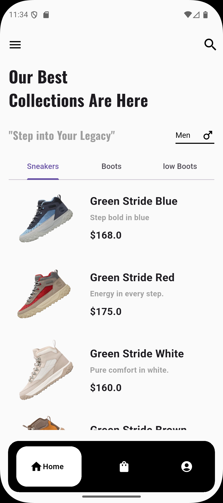
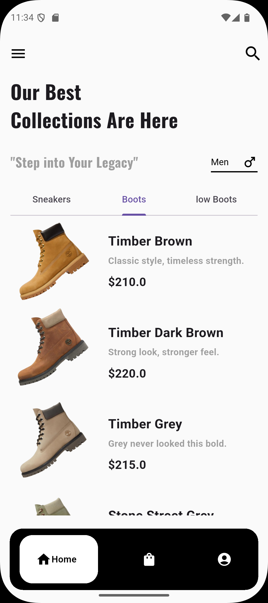
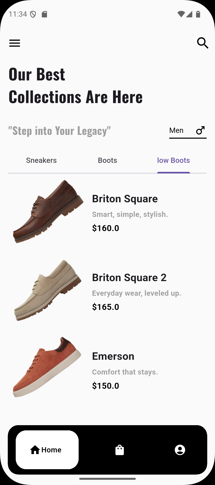
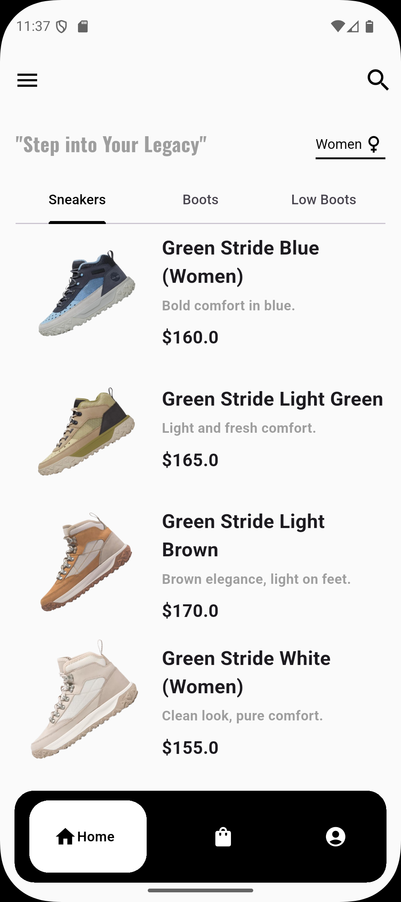
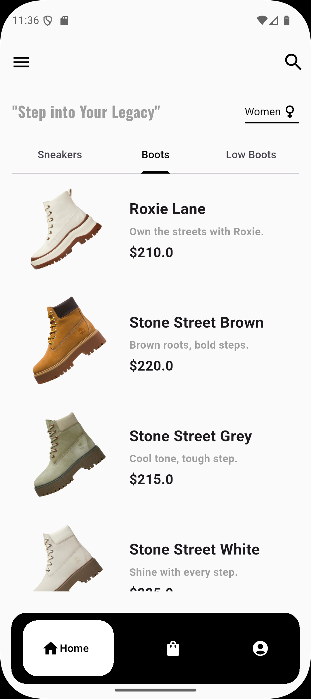
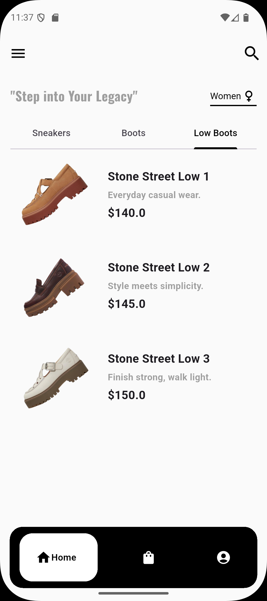
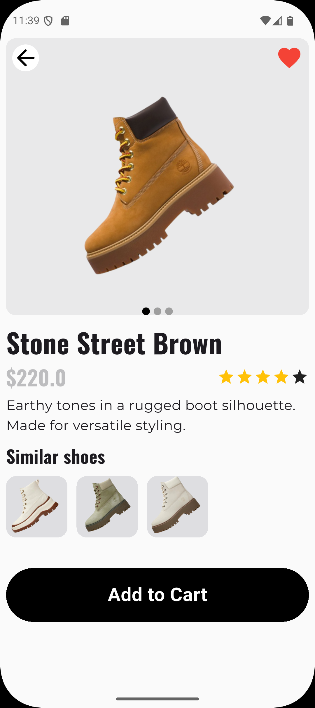
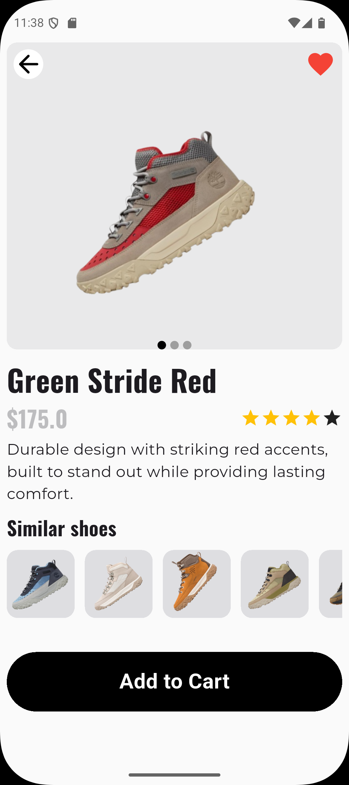
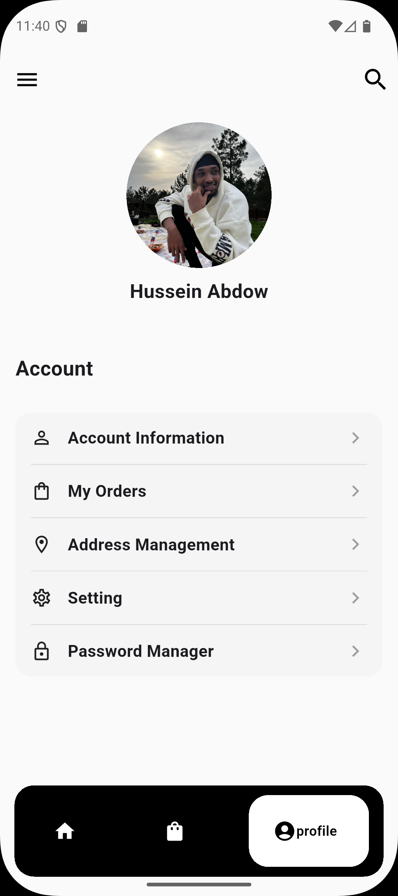
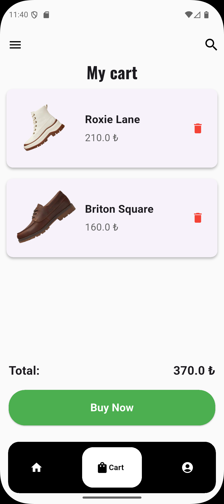

# <h1 align="center">🥾 Timberfy</h1>

<p align="center">
  A Flutter shopping app inspired by Timberland-style footwear.
</p>

<p align="center">
  Flutter • PostgreSQL • Mobile UI • Portfolio Project
</p>

---

## 📱 UI Preview

<p align="center">
  <a href="https://www.linkedin.com/posts/husseinabdow_i-built-timberfy-with-flutter-and-postgresql-ugcPost-7420594022743691264-xCPd/?utm_source=social_share_send&utm_medium=member_desktop_web&rcm=ACoAAEuKLNYB_ef_5a7F5UR8WZe9ocCBe0wY94M" target="_blank">
    
  </a>
</p>

### 🚀 Onboarding Experience

<p align="center">
  
  
  
</p>

<p align="center">
  
</p>

---

### 👞 Men Collection

<p align="center">
  
  
  
</p>

---

### 👠 Women Collection

<p align="center">
  
  
  
</p>

---

### 🔍 Shoe Details

<p align="center">
  
  
</p>

---

### 💼 Other Features

<p align="center">
  
  
</p>

---

## ✨ Features

* Browse shoes by gender & category
* Detailed product pages with multiple images
* Like products ❤️
* Add items to cart 🛒
* Reusable Flutter UI components
* Local PostgreSQL database integration
* Clean and scalable folder structure
* Smooth onboarding experience

---

## 🛠️ Tech Stack

| Technology | Usage                     |
| ---------- | ------------------------- |
| Flutter    | Mobile application        |
| Dart       | App logic                 |
| PostgreSQL | Local database            |
| SQL        | Database schema & queries |

---

## 📁 Project Structure

```bash
lib/
├── component/
├── configs/
├── models/
├── onboardingScreen/
├── pages/
├── shoeDisplay/
├── shoeTiles/
└── main.dart
```

### 🔹 Components

* Bottom navigation bar
* Dropdowns
* Tabs
* Reusable widgets

### 🔹 Pages

* Home
* Shoe details
* Cart
* Profile
* Similar shoes
* Login (coming soon)

### 🔹 Categories

* Men boots
* Women boots
* Sneakers
* Low boots

---

## 🗄️ Database Overview

Timberfy uses a local PostgreSQL database instead of cloud services.

### Main Tables

| Table     | Purpose                        |
| --------- | ------------------------------ |
| shoe      | Stores shoe information        |
| shoeimage | Stores multiple product images |
| cart      | Stores cart items              |
| likes     | Stores liked products          |
| appuser   | Demo user information          |

📄 SQL File:

```bash
database/timberfydb.sql
```

> Database configuration files are ignored from Git for security.

---

## 🔗 Entity Relationships

* One shoe can have multiple images
* Shoes can be liked
* Shoes can be added to cart
* Images are loaded through local asset paths stored in the database

---

## ⚙️ Running the Project

### 1️⃣ Clone the repository

```bash
git clone https://github.com/HusseinAbdow/timberfy.git
cd timberfy
```

### 2️⃣ Install dependencies

```bash
flutter pub get
```

### 3️⃣ Setup PostgreSQL database

```bash
createdb timberfydb
psql -d timberfydb -f timberfydb.sql
```

---

## 📌 Notes

* No Firebase or cloud services used
* Built mainly for portfolio and learning purposes
* Focused on UI design + local data structure
* Authentication system still under development

---

## 👤 Author

**Hussein Abdow**

Computer Engineering Student focused on Flutter and Backend Development.

* GitHub: [https://github.com/HusseinAbdow](https://github.com/HusseinAbdow)
* LinkedIn: [https://www.linkedin.com/in/husseinabdow](https://www.linkedin.com/in/husseinabdow)
